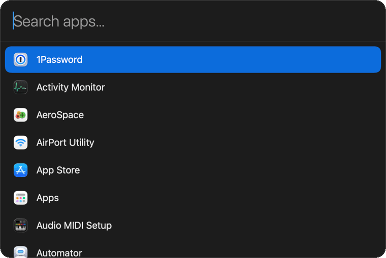

# Zap ⚡

A minimal macOS application launcher. Press **⌥Space** (or **⌘Space**), type, hit **Enter**
to launch. It searches *only* your installed applications — a focused, Spotlight-style
launcher and nothing else. Runs as a menu-bar agent with no Dock icon.



## Features

- Global **⌥Space** and **⌘Space** hotkeys — no Accessibility permission required
  (Carbon `RegisterEventHotKey`). ⌥Space works immediately; ⌘Space needs Spotlight freed.
- Fuzzy search over `/Applications`, `/System/Applications`, and `~/Applications`
  (including one nested level, e.g. `Utilities`, and hidden system apps like Safari).
- Boundary-aware ranking: `sysp` → System Settings, `ps` → Photoshop, prefixes win.
- Keyboard-driven: ↑/↓ to move, Enter to launch, Esc (or click away) to dismiss.
- Re-scans on every open, so newly installed apps appear immediately.

## Install

### Homebrew

```sh
brew tap natejsimonsen/zap https://github.com/natejsimonsen/zap
brew install --cask natejsimonsen/zap/zap
```

> Use the fully-qualified `natejsimonsen/zap/zap` — the bare `zap` cask name is
> already taken by an unrelated tool in Homebrew's main cask repo.

Zap is not notarized, so the first launch triggers Gatekeeper. Either right-click
`Zap.app` in `/Applications` → **Open**, or run `xattr -dr com.apple.quarantine /Applications/Zap.app`.

### Nix

```sh
nix run github:natejsimonsen/zap      # run once
nix profile install github:natejsimonsen/zap   # install
```

### flox

```sh
flox install 'github:natejsimonsen/zap'   # into your flox env
zap-autostart                             # (optional) start Zap at login
```

The package ships `zap-autostart` (and `zap-autostart-off`) on `PATH`, so a flox install
can enable a login item with **one command — no repo checkout**. It installs a
LaunchAgent pointing at the stable `~/.flox/run/…` path, so it survives `flox upgrade`.
`flox install` alone won't create the login item — Nix/flox don't mutate the host on
install, so running `zap-autostart` once is the imperative opt-in.

### From a release

Download `Zap.zip` from the [latest release](https://github.com/natejsimonsen/zap/releases),
unzip, and move `Zap.app` to `/Applications`.

### From source

```sh
git clone https://github.com/natejsimonsen/zap && cd zap
make install        # builds Zap.app and copies it to /Applications
open /Applications/Zap.app
```

## Start at login

```sh
make autostart       # install a LaunchAgent and start Zap now
make autostart-off   # remove it
```

`make autostart` installs `~/Library/LaunchAgents/com.zap.launcher.plist` pointing at your
install (flox or `/Applications`) and launches Zap immediately. For a flox install it
resolves the stable `~/.flox/run/…` path, so it keeps working across `flox upgrade`.
(For an `/Applications` install you can instead just add `Zap.app` to
**System Settings → General → Login Items**.)

A flox install exposes the same helper on `PATH` — run `zap-autostart` once (and
`zap-autostart-off` to undo). No repo checkout needed.

### Fully automatic in a flox environment

`flox install` can't create the login item on its own (Nix/flox don't mutate the host on
install). To make it fully hands-off — including for a **shared team environment** — add
both the package and a guarded activation hook to that environment's
`.flox/env/manifest.toml`:

```toml
[install]
zap.flake = "github:natejsimonsen/zap"

[profile]
# Set up the login item on first activation; idempotent and cheap afterward
# (skips once the LaunchAgent is loaded, which launchd does at every login).
common = '''
  if command -v zap-autostart >/dev/null 2>&1 && ! launchctl print "gui/$(id -u)/com.zap.launcher" >/dev/null 2>&1; then
    zap-autostart >/dev/null 2>&1 || true
  fi
'''
```

Anyone who activates that environment then gets Zap **and** autostart with zero manual
steps. The hook is a no-op on every activation after the first, so it won't restart Zap
when you open a new shell.

## Hotkeys

Zap binds **⌥Space** and **⌘Space**, and either one toggles it.

- **⌥Space** is free by default, so Zap works right away with no setup.
- **⌘Space** is owned by Spotlight. To use it, free it first:
  **System Settings → Keyboard → Keyboard Shortcuts → Spotlight →** uncheck
  **"Show Spotlight search"** (⌘Space).

Zap logs a message via `NSLog` if it can't register a hotkey another app already owns.

## Configuration

Zap runs with sensible defaults and needs no config. To customize, create
`~/.config/zap/config.json` — all keys are optional, and a missing or malformed file
falls back to defaults:

```json
{
  "searchPaths": ["~/Developer/Apps", "/opt/homebrew/Caskroom"],
  "accentColor": "purple",
  "transparency": 0.8,
  "density": "comfortable",
  "hotkeys": ["opt+space", "cmd+space"]
}
```

| Key | Values | Default | Effect |
|-----|--------|---------|--------|
| `searchPaths` | list of dirs (`~` allowed) | `[]` | Extra folders to scan, **added** to the built-in defaults |
| `accentColor` | hex (`#RRGGBB`, `#RGB`, `#RRGGBBAA`) or a name: `blue` `purple` `pink` `red` `orange` `yellow` `green` `teal` `graphite` | system accent | Selection highlight color |
| `transparency` | `0.0`–`1.0` | `0.8` | `0` = opaque, `1` = maximum blur / most see-through |
| `density` | `compact` \| `simple` \| `comfortable` | `comfortable` | Row spacing, font, icon, and window size |
| `hotkeys` | list of `mod+…+key` (mods: `cmd` `opt` `ctrl` `shift`; keys: letters, digits, `space`, `return`, `tab`, `escape`) | `["opt+space", "cmd+space"]` | Global keys that toggle the launcher; all valid ones register |

`searchPaths`, `accentColor`, `transparency`, and `density` take effect the next time you
open the launcher. **`hotkeys` are read once at launch** — quit and relaunch Zap to apply.
An all-invalid `hotkeys` list falls back to the defaults, so a typo never locks you out.

## Usage

| Key | Action |
|-----|--------|
| ⌥Space / ⌘Space | Toggle the launcher |
| type | Fuzzy-filter applications |
| ↑ / ↓ | Move selection |
| Enter | Launch selected app |
| Esc / click away | Dismiss |

## Development

```sh
make            # list targets
make build      # compile a release binary
make test       # run the ZapCore checks
make run        # run without bundling
make app        # build Zap.app
make nix-build  # build via the Nix flake
```

> `swift test` needs a full Xcode toolchain (XCTest/Testing). With Command Line Tools
> only, use `make test` (`swift run ZapCoreTests`) — same coverage, plain-toolchain friendly.

See [docs/ARCHITECTURE.md](docs/ARCHITECTURE.md) for how it fits together.

## License

MIT — see [LICENSE](LICENSE).
